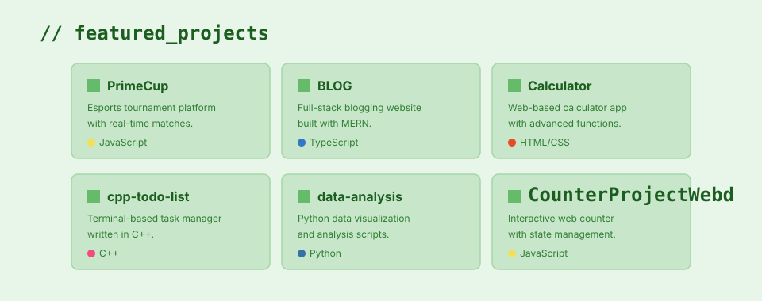
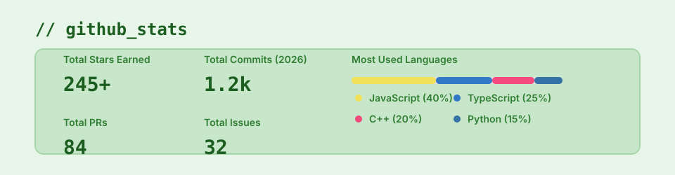

<!-- ══════════════════════════════════════════════════════════════ -->
<!--  AYUSH KUMAR · GitHub Profile · Premium Green Portfolio      -->
<!--  Username: singhayush1807                                    -->
<!-- ══════════════════════════════════════════════════════════════ -->

<!-- ═══════════════ HERO BANNER (Includes Wave Header) ═══════════════ -->
<picture>
  
</picture>

<!-- ═══════════════ QUICK NAV ═══════════════ -->

 

&nbsp;
&nbsp;
&nbsp;
&nbsp;
&nbsp;

 

<!-- ═══════════════ ABOUT ═══════════════ -->

## 👋 Hey there! I'm Ayush Kumar

> **Name:** Ayush Kumar  
> **Role:** B.Tech CSE Student · Full Stack Developer  
> **Home:** Vaishali, Bihar 🇮🇳  
> **College:** Poornima College of Engineering, Jaipur  
> **Mindset:** Code · Learn · Build · Repeat  

I'm a Computer Science student passionate about building **real-world applications**.
From tournament platforms to blog websites, I love turning ideas into working
software using the **MERN stack**, **C++**, and **Python**.

 

<!-- ═══════════════ DEVELOPER ID CARD ═══════════════ -->

## 🪪 Developer ID

  

 

<!-- ═══════════════ TECH SKILLS ═══════════════ -->

## 💻 Tech Stack

#### Languages

#### Frameworks & Libraries

#### Tools & Platforms

 

<!-- ═══════════════ CURRENTLY LEARNING ═══════════════ -->

## 📚 Currently Learning

  

 

<!-- ═══════════════ FEATURED PROJECTS ═══════════════ -->

## 🚀 Featured Projects

  

 

<!-- ═══════════════ GITHUB STATS ═══════════════ -->

## 📈 GitHub Stats

  

 

<!-- ═══════════════ CONTRIBUTION SNAKE ═══════════════ -->

## 🐍 Contribution Snake

<!-- The snake will appear here once the GitHub Action runs. -->
<picture>
  <source media="(prefers-color-scheme: dark)"  srcset="https://raw.githubusercontent.com/singhayush1807/singhayush1807/output/github-snake-dark.svg">
  <source media="(prefers-color-scheme: light)" srcset="https://raw.githubusercontent.com/singhayush1807/singhayush1807/output/github-snake.svg">
  
</picture>

> **Note:** To see the snake animation, go to the **Actions** tab in this repository, click **Generate GitHub Snake**, and click **Run workflow**.

 

<!-- ═══════════════ CONNECT ═══════════════ -->

## 🤝 Let's Connect

  

  

**Thanks for visiting! ⭐ Let's build something amazing together 🚀**

 

[⬆ back to top](#top)

<!-- ═══════════════ ANIMATED FOOTER ═══════════════ -->

