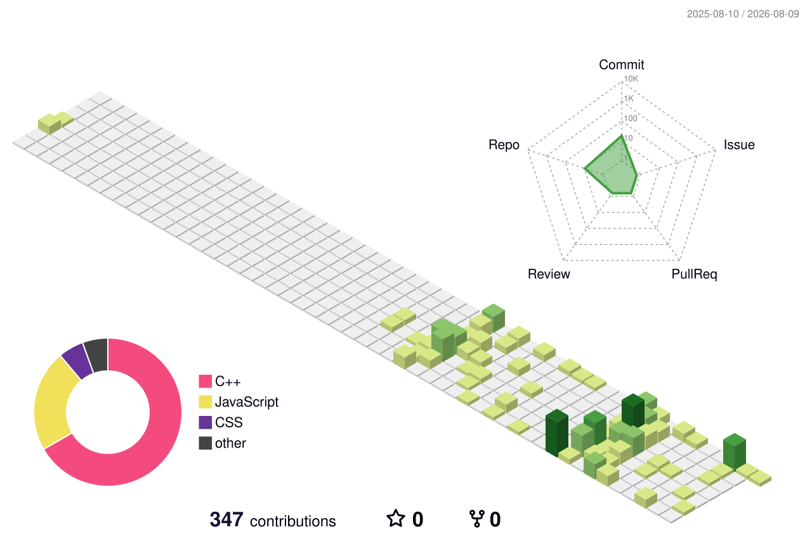

<!-- ══════════════════════════════════════════════════════════════ -->
<!--  AYUSH KUMAR · GitHub Profile · Premium Green Portfolio      -->
<!--  Username: singhayush1807                                    -->
<!-- ══════════════════════════════════════════════════════════════ -->

<!-- ═══════════════ HEADER WAVE ═══════════════ -->

<!-- ═══════════════ SEAMLESS GREEN BOARD PROFILE ═══════════════ -->

  
  
    
  
  
  
  
    
  
  
  <!-- Tech Stack with real SkillIcons -->
  
   
  <h4>Languages</h4>
  
   
  <h4>Frameworks & Libraries</h4>
  
   
  <h4>Tools & Platforms</h4>
  
  
    
  
  
  
   
  
  <!-- REAL GITHUB STATS -->
  
  
  
   
  
  
  &nbsp;
  

    

  

    

  <!-- 3D Contribution Graph (Generated by Action) -->
  
  
  
   
  
  <picture>
    
  </picture>
  
  > **Note:** To see the 3D graph, go to the **Actions** tab in this repository, click **generate-github-profile-3d-contrib**, and click **Run workflow**.

    

  <!-- GitHub Activity Snake (Always Real-Time) -->
  
  
  
  <picture>
    <source media="(prefers-color-scheme: dark)"  srcset="https://raw.githubusercontent.com/singhayush1807/singhayush1807/output/github-snake-dark.svg">
    <source media="(prefers-color-scheme: light)" srcset="https://raw.githubusercontent.com/singhayush1807/singhayush1807/output/github-snake.svg">
    
  </picture>
  
  > **Note:** To see the snake animation, go to the **Actions** tab in this repository, click **Generate GitHub Snake**, and click **Run workflow**.

   
  
  
  

<!-- ═══════════════ FOOTER WAVE ═══════════════ -->

